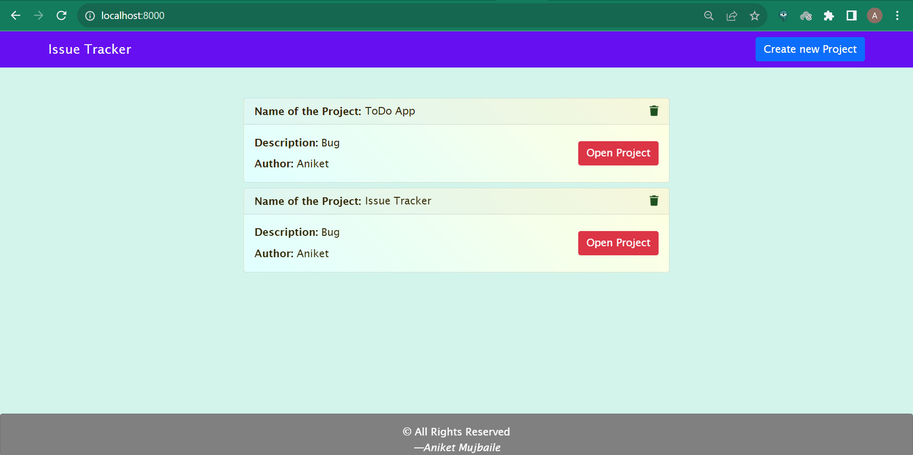
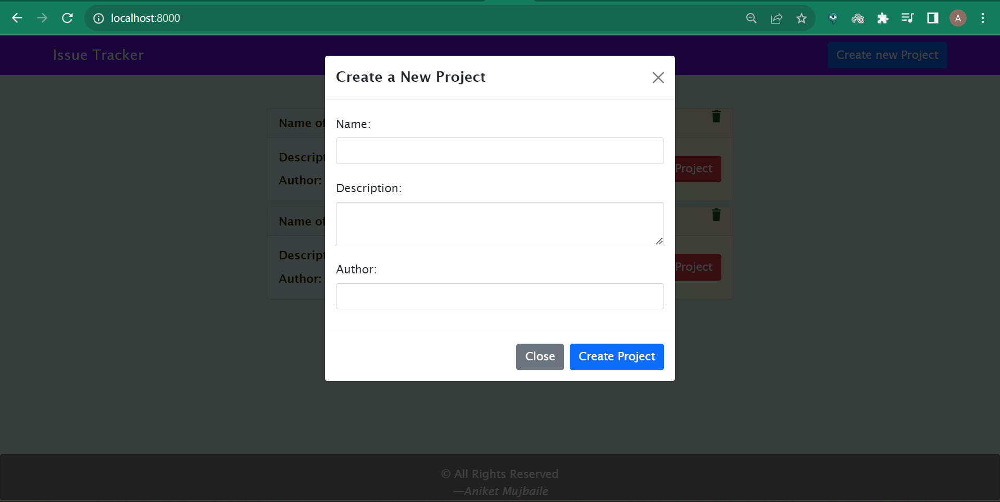
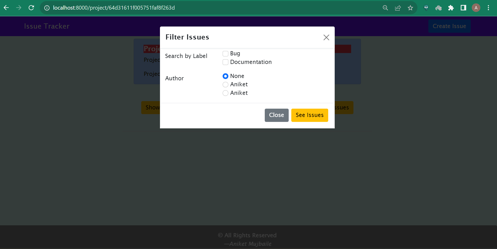
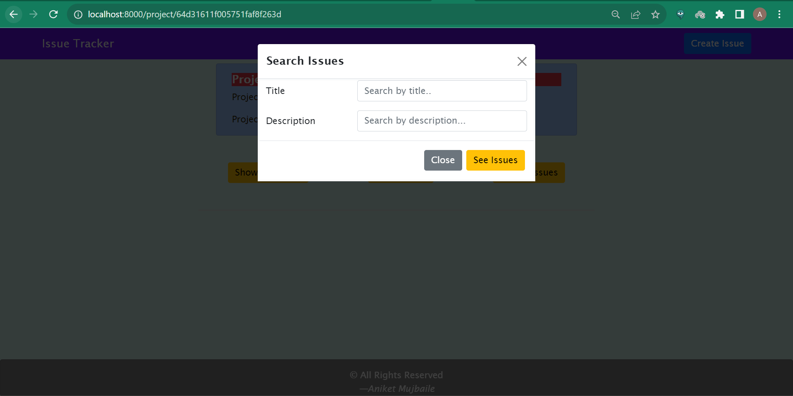

# ⚠️Issue Tracker

Created an Issue Tracker Web Application.

### 🔗 Hosted link: [Employee review system](https://issue-tracker-rhhe.onrender.com/)

## ✨Features

● Home Page
 
  * Shows a list of projects
  * Given a button to create a new Project (On creating a new project it
    appear in the list)
    
● Create Project Page
  * Accepts the following fields to create a project
    * Name
    * Description
    * Author
  
● Project Detail Page
  * When the user clicks on a project (in home page) it redirects the user to this
    page which shows bugs related to that project
  * User is able to perform following actions on this page
    * Filter by multiple labels i.e. able to filter by 2 or more
      labels at the same time
    * Filter by author
    * Search by title and description
  * A button to create an issue

● Create issue page
  * User able to create an issue for a project
  * Accept the following fields
    * Title
    * Description
    * Labels (multiple labels can be added to a project)
    * Author


## 🛠️ Tools Used


<br>


## 📐Installation
 1)Download Zip and Extract it and then run following commands in directory

 2)Install my-project by running below command in console
```bash
  npm install
```
 3)execute below command to run the server on localhost
```bash
  npm start
```

## 🧑‍💻 Preview...
Main Page


Create Project Page


All Issues


Filter Issues


Search Issues



## Folder Structure

* assets
    1. css
        - footer.css
        - header.css
        - home.css
        - issue_page.css
        - layout.css
        - project_page.css
    2. images
    3. js
        - delete_issue.js
        - delete_project.js
        - filterIssue.js
        - searchIssue.js
* config
    - middleware.js
    - mongoose.js
* controllers
    - home_controller.js
    - project_controller.js
* models
    - create_issue.js
    - create_project.js
* routes
    - index.js
    - project.js
* views
   1. partials
        - _footer.ejs
        - _header.ejs
        - _issue_form.ejs
        - _issue_page.ejs
        - _project_form.ejs
    - home.ejs
    - layout.ejs
    - project_page.ejs
- .gitignore
- index.js
- package-lock.json
- package.json


